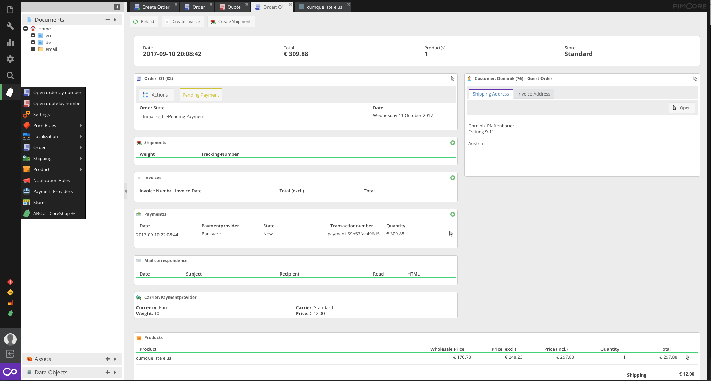
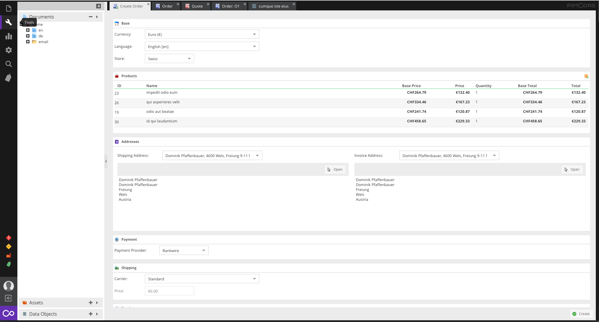
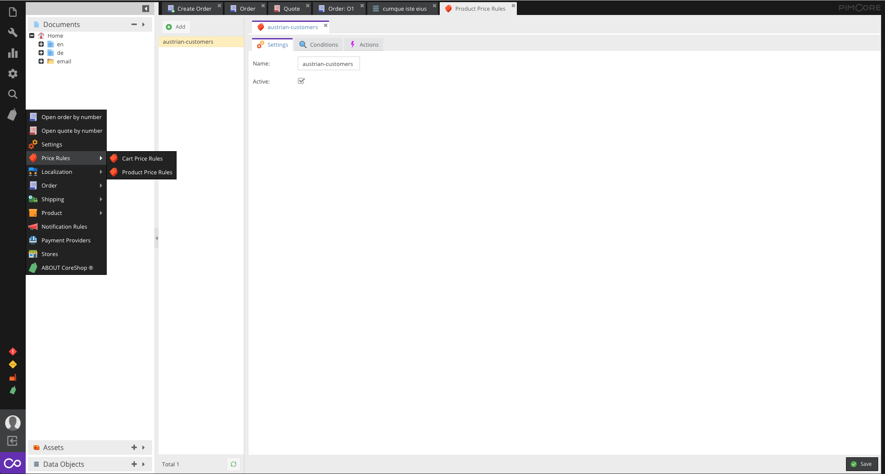

# CoreShop 2 (Development)

**CoreShop 2 - A eCommerce Framework based on Pimcore and Symfony.**

### CoreShop 1
Looking for the current stable (version 1)?
See https://github.com/coreshop/CoreShop/tree/coreshop1

[](https://gitter.im/coreshop/coreshop?utm_source=badge&utm_medium=badge&utm_campaign=pr-badge&utm_content=badge)
[](https://travis-ci.org/coreshop/CoreShop)
[](LICENSE.md)
[](https://www.packagist.org/packages/coreshop/core-shop)
[](https://www.scrutinizer-ci.com/g/coreshop/CoreShop/)
[](https://www.coreshop.org/bitcoin)

CoreShop is a Bundle for [Pimcore](http://www.pimcore.org). It enhances Pimcore with eCommerce features.



# Requirements
* Pimcore 5.4

# Installation
 - Install with composer ```composer require coreshop/core-shop dev-master```
 - Run enable Bundle command
    ```php bin/console pimcore:bundle:enable CoreShopCoreBundle```
 - Run Install Command
    `php bin/console coreshop:install`
 - Optional: Install Demo Data `php bin/console coreshop:install:demo`

# Further Information
 - [Website](https://www.coreshop.org)
 - [Documentation](https://www.coreshop.org/docs/latest)
 - [Pimcore Forum](https://talk.pimcore.org)
 - [Help translate CoreShop](https://crowdin.com/project/coreshop)

# Demo
You can see a running demo here [CoreShop Demo](https://demo2.coreshop.org)

**Backend Credentials**

```
Admin: https://demo2.coreshop.org/admin

Username: admin
Password: coreshop
```

## Copyright and license 
Copyright: [Dominik Pfaffenbauer](https://www.pfaffenbauer.at)
For licensing details please visit [LICENSE.md](LICENSE.md) 

## Screenshots


