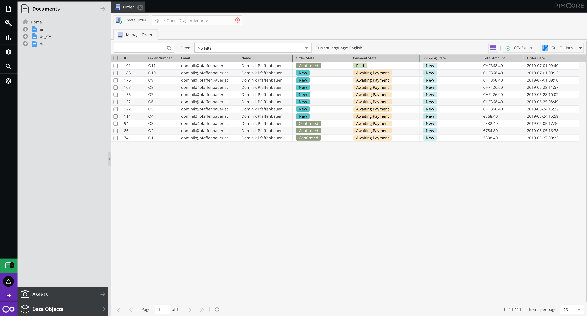

---

**CoreShop - Pimcore eCommerce**

[](https://gitter.im/coreshop/coreshop?utm_source=badge&utm_medium=badge&utm_campaign=pr-badge&utm_content=badge)


[](LICENSE.md)
[](https://www.packagist.org/packages/coreshop/core-shop)

[CoreShop](https://www.coreshop.org) is a eCommerce Platform for [Pimcore](http://www.pimcore.org).


# Requirements
* Pimcore ^10

# Installation
 - Allow dev version to be installed:
   ```
   composer config "minimum-stability" "dev"
   composer config "prefer-stable" "true"
   ```
 - Install with composer 
   ```
   composer require coreshop/core-shop:^3.0
   ```
 - Run enable Bundle command
   ```
   php bin/console pimcore:bundle:enable CoreShopCoreBundle
   ```
 - Run Install Command
   ```
   php bin/console coreshop:install
   ```
 - Optional: Install Demo Data 
   ```
   php bin/console coreshop:install:demo
   ```

# Further Information
 - [Website](https://www.coreshop.org)
 - [Documentation](https://docs.coreshop.org/latest)
 - [Pimcore Forum](https://talk.pimcore.org)
 - [Help translate CoreShop](https://crowdin.com/project/coreshop)

# Demo
You can see a running demo here [CoreShop 3.x Demo](https://demox.coreshop.org)

**Backend Credentials**

```
Admin: https://demox.coreshop.org/admin

Username: admin
Password: coreshop
```

## Copyright and license 
Copyright: [CoreShop GmbH](https://www.coreshop.org)
For licensing details please visit [LICENSE.md](LICENSE.md) 

## Screenshots


