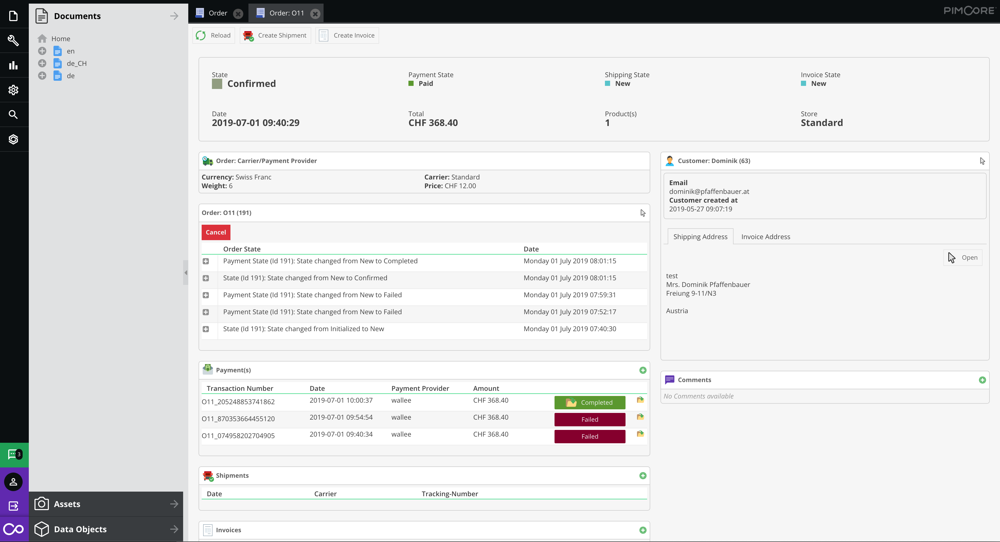

# CoreShop 2 (Development)

**Looking for the current stable (version 1)?
See https://github.com/coreshop/CoreShop/tree/coreshop1**

**I am happy to announce CoreShop 2 - Pimcore eCommerce Framework, the best CoreShop since CoreShop - now totally based on Symfony.**

[](https://gitter.im/coreshop/coreshop?utm_source=badge&utm_medium=badge&utm_campaign=pr-badge&utm_content=badge)
[](https://travis-ci.org/coreshop/CoreShop)
[](LICENSE.md)
[](https://www.packagist.org/packages/coreshop/core-shop)
[](https://www.scrutinizer-ci.com/g/coreshop/CoreShop/)
[](https://www.coreshop.org/bitcoin)

CoreShop is a Bundle for [Pimcore](http://www.pimcore.org). It enhances Pimcore with eCommerce features.



# Requirements
* Pimcore 5.1.0

# Installation
 - Install with composer ```composer require coreshop/core-shop dev-master```
 - Add Following Call to AppKernel's registerBundlesToCollection function
    ```php
        \CoreShop\Bundle\CoreBundle\Application\RegisterBundleHelper::registerBundles($collection);
    ```
 - Add Following to your app/config/config.yml
    ```yml
        imports:
            - { resource: "@CoreShopCoreBundle/Resources/config/app/config.yml" }
    ```
 - Run Install Command
    ```php bin/console coreshop:install```
 - Optional: Install Demo Data ```php bin/console coreshop:install:demo```

# Further Information
 - [Website](https://www.coreshop.org)
 - [Documentation](https://www.coreshop.org/docs/latest)
 - [Pimcore Forum](https://talk.pimcore.org)

# Demo
You can see a running demo here [CoreShop Demo](https://demo2.coreshop.org)

# Migration from CoreShop 1
If you want to migrate some of your data from CoreShop 1, you can use the Import/Export Bundle:
 - [Export from CoreShop1](https://github.com/coreshop/CoreShopExport)
 - [Import into CoreShop2](https://github.com/coreshop/ImportBundle)

## Copyright and license 
Copyright: [Dominik Pfaffenbauer](https://www.pfaffenbauer.at)
For licensing details please visit [LICENSE.md](LICENSE.md) 

## Screenshots


