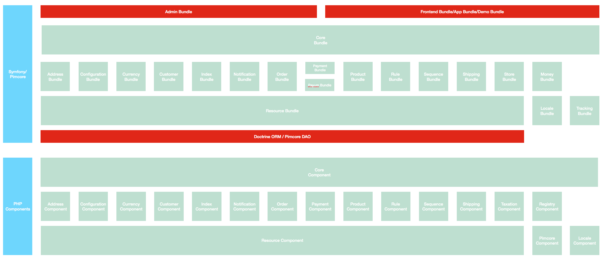

# CoreShop Architecture

CoreShop is completely open source (GPl license) and free, maintained by diverse and creative community of developers and companies.

What are our core values and what makes us different from other solutions?

 - Components based approach
 - Unlimited flexibility and simple customization
 - Developer-friendly, using latest technologies
 - Highest quality of code

# The Three Natures of CoreShop

CoreShop is constructed from fully decoupled and flexible e-commerce components for PHP.
It is also a set of Symfony bundles, which integrate the components into the full-stack framework.
On top of that, CoreShop is also a complete eCommerce suite crafted from all these building blocks.

It is your choice how to use CoreShop, you can benefit from the components with any framework,
integrate selected bundles into existing or new Pimcore app or built your application on top of CoreShop Suite.

# CoreShop Suite

This book is about our full-stack eCommerce suite, which is a standard Pimcore Bundle providing the most common webshop and a foundation for custom systems.

# Leveraging Symfony Bundles

If you prefer to build your very custom system step by step and from scratch,
you can integrate the standalone Symfony bundles.
For the installation instructions, please refer to the appropriate bundle documentation.

## Difference to the official Pimcore eCommerce Framework

The eCommerce Framework provides you with a basic Toolset for eCommerce Development.
CoreShop gives you a feature-rich Toolset of common needed Tools for rich and complex eCommerce Solutions.

> **Example I:** the Framework does'nt give you the full opportunity for calculating complex Shipping Prices.
> You need to code it by yourself. CoreShop provides you with Carriers and Shipping Rules to do that.

CoreShops Bundles are build to be used individually. The CoreBundle combines all the Features.

# Architecture Overview

CoreShop Suite is build on CoreShop Components and Bundles.
The CoreBundle and CoreComponent glues all different Bundles and Components into one eCommerce Suite for B2B and B2C Solutions.

