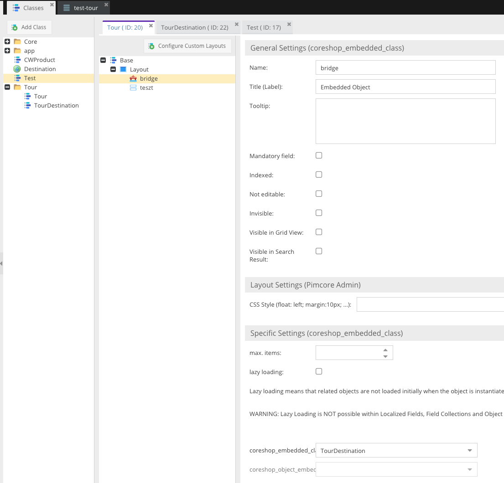
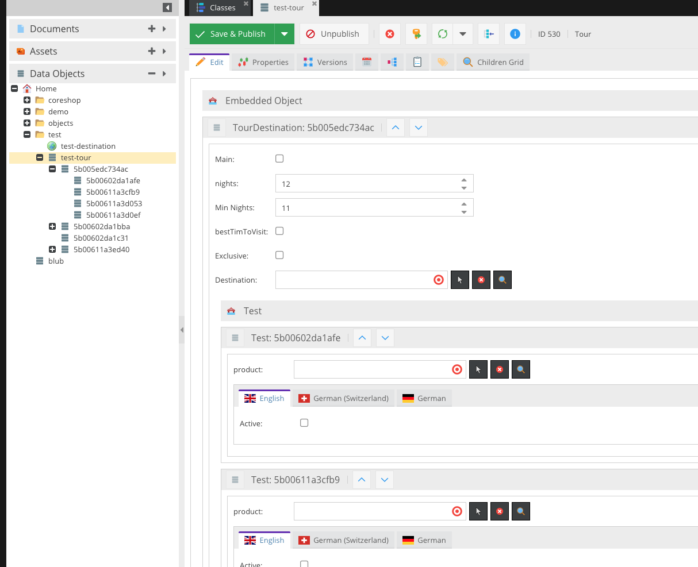

# CoreShop Pimcore Bundle

## Installation
```bash
$ composer require coreshop/pimcore-bundle:^3.0
```

### Activating Bundle
You need to enable the bundle inside the kernel or with the Pimcore Extension Manager.

```php
<?php

// app/AppKernel.php

public function registerBundlesToCollection(BundleCollection $collection)
{
    $collection->addBundles([
        new \CoreShop\Bundle\PimcoreBundle\CoreShopPimcoreBundle()
    ]);
}
```

## Usage

The CoreShopPimcoreBundle integrates the CoreShop Pimcore Component into Symfony automatically registers a lot of services for you.

### JS/CSS Resource Loading
With Pimcore, every bundle needs to take care about loading static assets themselve. PimcoreBundle helps you out here, follow these steps to use it:

- Create a DependencyInjection Extension class like:

```php
<?php

namespace AppBundle\DependencyInjection;

use CoreShop\Bundle\ResourceBundle\DependencyInjection\Extension\AbstractModelExtension;
use Symfony\Component\Config\FileLocator;
use Symfony\Component\DependencyInjection\ContainerBuilder;
use Symfony\Component\DependencyInjection\Loader\YamlFileLoader;

class AppExtension extends AbstractModelExtension
{
    public function load(array $config, ContainerBuilder $container)
    {
        $config = $this->processConfiguration($this->getConfiguration([], $container), $config);

        $loader = new YamlFileLoader($container, new FileLocator(__DIR__.'/../Resources/config'));
        $loader->load('services.yml');

        $this->registerPimcoreResources('coreshop', $config['pimcore_admin'], $container);
    }
}
```

- Create a DependencyInjection Configuration class like:

```php
<?php

namespace AppBundle\DependencyInjection;

use Symfony\Component\Config\Definition\Builder\ArrayNodeDefinition;
use Symfony\Component\Config\Definition\Builder\TreeBuilder;
use Symfony\Component\Config\Definition\ConfigurationInterface;

final class Configuration implements ConfigurationInterface
{
    /**
     * {@inheritdoc}
     */
    public function getConfigTreeBuilder()
    {
        $treeBuilder = new TreeBuilder();
        $rootNode = $treeBuilder->root('app');

        $this->addPimcoreResourcesSection($rootNode);

        return $treeBuilder;
    }

    /**
     * @param ArrayNodeDefinition $node
     */
    private function addPimcoreResourcesSection(ArrayNodeDefinition $node)
    {
        $node->children()
            ->arrayNode('pimcore_admin')
                ->addDefaultsIfNotSet()
                ->children()
                    ->arrayNode('js')
                        ->addDefaultsIfNotSet()
                        ->ignoreExtraKeys(false)
                        ->children()
                            ->scalarNode('test')->defaultValue('/bundles/app/pimcore/js/test.js')->end()
                        ->end()
                    ->end()
                    ->arrayNode('css')
                        ->addDefaultsIfNotSet()
                        ->ignoreExtraKeys(false)
                        ->children()
                            ->scalarNode('test')->defaultValue('/bundles/app/pimcore/css/pimcore.css')->end()
                        ->end()
                    ->end()
                ->end()
            ->end()
        ->end();
    }
}

```

- That's it, PimcoreBundle now takes care about loading your resources and also bundles them in non DEV-Mode.

### DataObject Extensions

#### Serialized Data
This extension allows you to store SerializedData inside a Pimcore DataObject.

#### Embedded Class
This extension allows you to embed other Pimcore Classes into one Pimcore Class.

The data tree looks like this then:

- object
    - embeddedObject1
    - embeddedObject2
        - subEmbeddedObject1

You can inherit this as deep as you want, but be careful. The deeper it goes, the more time it takes to save, as it persists every subobject.




