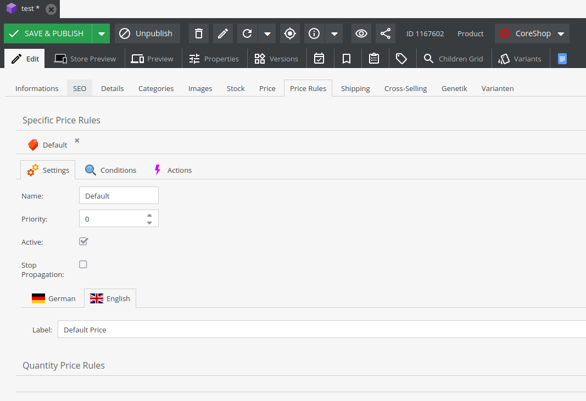

# CoreShop Specific Price Rules

Specific Prices are basically the same as Product Price Rules, but are configured directly on the
product and therefore are only applied on that product.

It is recommended to have at least one specific price, which is always applicable. For example a
rule with no conditions.

## Available Actions

- [Price](./06_Actions.md#new-price)
- [Discount Price](./06_Actions.md#discount-price)
- [Discount Amount](./06_Actions.md#discount-amount)
- [Discount Percent](./06_Actions.md#discount-percent)

## Available Conditions

- [Customers](./07_Conditions.md#customers)
- [Customer Groups](./07_Conditions.md#customer-groups)
- [Time Span](./07_Conditions.md#time-span)
- [Countries](./07_Conditions.md#countries)
- [Zones](./07_Conditions.md#zones)
- [Stores](./07_Conditions.md#stores)
- [Currencies](./07_Conditions.md#currencies)
- [Nested Rules](./07_Conditions.md#nested-rules)
