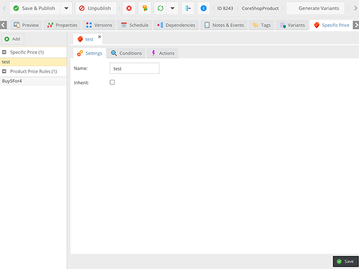

# CoreShop Specific Price Rules

Specific Prices are basically the same as Product Price Rules, but they are only applied on a single product.

## Available Actions

- [Price](./05_Actions.md#price)
- [Discount Price](./05_Actions.md#discount-price)
- [Discount Amount](./05_Actions.md#discount-amount)
- [Discount Percent](./05_Actions.md#discount-percent)

## Available Conditions

- [Customers](./06_Conditions.md#customers)
- [Customer Groups](./06_Conditions.md#customer-groups)
- [Time Span](./06_Conditions.md#time-span)
- [Countries](./06_Conditions.md#countries)
- [Zones](./06_Conditions.md#zones)
- [Stores](./06_Conditions.md#stores)
- [Currencies](./06_Conditions.md#currencies)
- [Nested Rules](./06_Conditions.md#nested-rules)