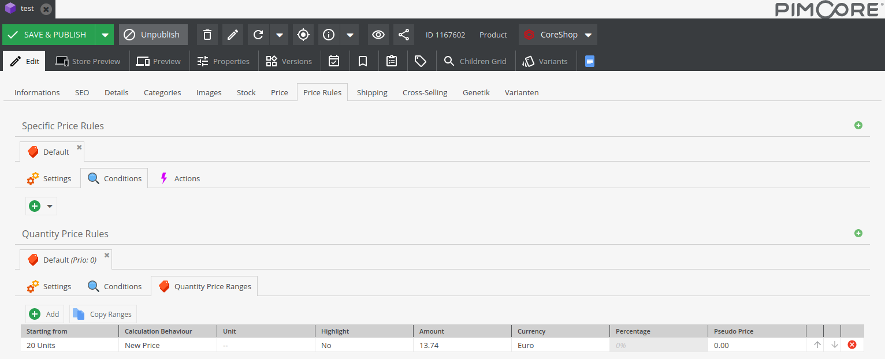

# CoreShop Quantity Price Rules

Quantity Price Rules are configured directly on the product and therefore are only applied
on that product. The settings are different to specific price rules. Calculation Behaviour
means the property on which the amount is determined. This is volume per default.

Quantity price rules are only applied to the price in context of a cart. In other cases the
price calculator ignores them. So it is recommended to not have quantity price rules alone,
but to have at least a default specific price (or a store values entry).

## Available Conditions

- [Customers](./07_Conditions.md#customers)
- [Customer Groups](./07_Conditions.md#customer-groups)
- [Time Span](./07_Conditions.md#time-span)
- [Countries](./07_Conditions.md#countries)
- [Zones](./07_Conditions.md#zones)
- [Stores](./07_Conditions.md#stores)
- [Currencies](./07_Conditions.md#currencies)
- [Nested Rules](./07_Conditions.md#nested-rules)
