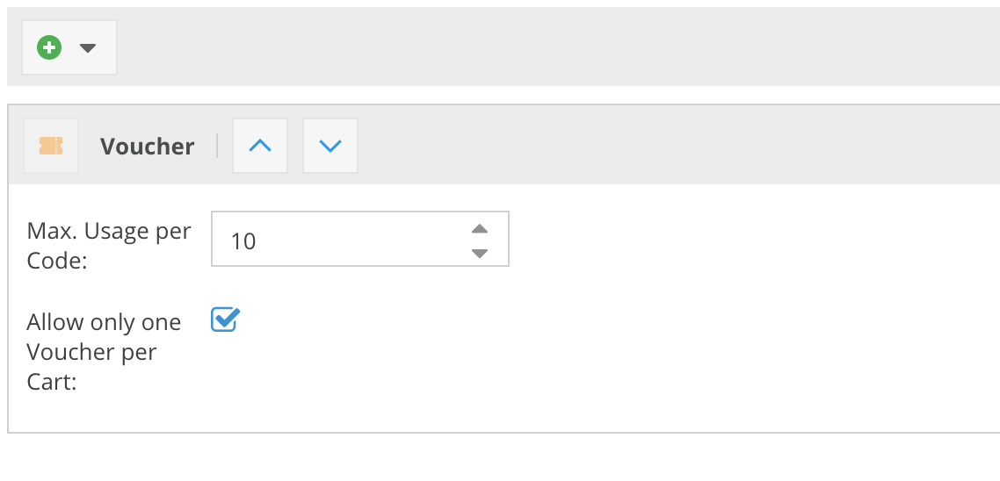
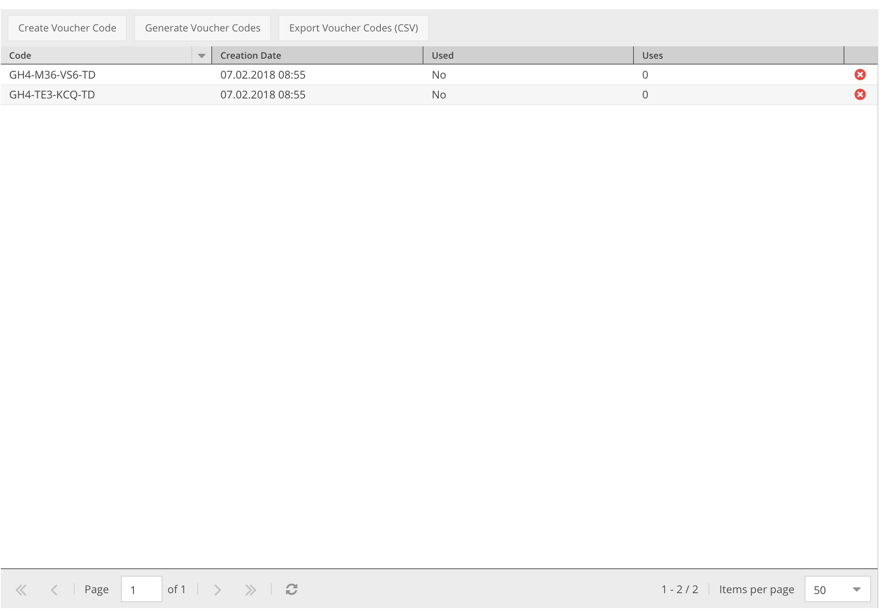

# CoreShop Vouchers

> **Info**: In CoreShop Vouchers are Price Rules too.
> To use or generate Vouchers you need to add a Cart Price Rule.

## How to create Vouchers
Simple create a new [cart price rule](./01_Cart_Price_Rules.md) and activate "Is Voucher Rule".
With that, the "Voucher Codes" tab gets enabled.

### Voucher Condition

If you need more control about handling Vouchers you need to add the "Voucher" Condition:

| Name | Description|
|:-----|:--------------------|
| Max. Usage per Code | Define how often a voucher code can be used. |
| Allow only one Voucher per Code | If checked, only one Voucher per Cart is allowed. |

### Voucher Codes

Within the "Voucher Codes" tab you're able to manage codes for the current price rule.
It's also possible to export generated codes to csv file.

> If you need more globally statistics about vouchers please use the [voucher report](../09_Reports/09_Vouchers.md).

| Name | Description|
|:-----|:--------------------|
| Code | Generated voucher code |
| Creation Date | Voucher creation date |
| Used | If the Voucher has been used you'll see a true statement |
| Uses | Amount of uses per code |
| Action | It's possible to delete voucher codes as long they're not in use |

### Create Voucher Code
There are two ways to generate Codes:

#### Single Voucher Code
Create a single voucher code.
The input field allows any string input, however if you already have added a code with the same string, you'll get a unique error message.

#### Voucher Codes Generator
This is the more advanced option to generate voucher codes:

| Name | Description|
|:-----|:--------------------|
| Amount | Define how many voucher codes should be generated |
| Length| Define the Voucher Code Length |
| Format | Voucher Format. Possible Values: `Alphanumeric`, `Alphabetic`, `Numeric` |
| Prefix | Define a prefix for each code. For example `SHOP-` |
| Suffix | Define a suffix for each code. For example `-SHOP` |
| Hyphens all X characters | Add a Dash (`-`) after every X character |
