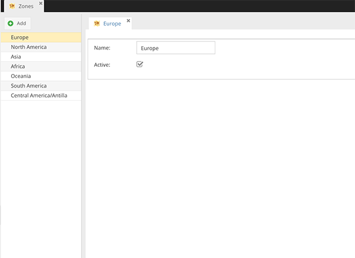

# Zone Configuration

In CoreShop, a 'Zone' functions as a group of countries and is defined by a set of attributes. Zones are primarily used
for configuring Price Rules and Shipping Rules. Here's an overview of the attributes for a Zone:

- **Name**: The designated name of the zone.
- **Active**: Indicates whether the zone is active and can be used in the store's operational settings.

