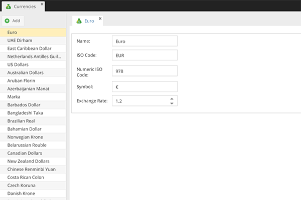

# Currencies

In CoreShop, the configuration of a currency involves several key attributes essential for international transactions
and currency management.

- **Name**: The official name of the currency.
- **ISO Code**: The standardized international three-letter code representing the currency.
- **Numeric ISO Code**: The numerical code assigned to the currency, as per international standards.
- **Symbol**: The graphical symbol or abbreviation used to denote the currency (e.g., $ for USD, € for EUR).

## Exchange Rates

CoreShop supports automated calculation of exchange rates, simplifying the process of maintaining current and accurate
currency information. This feature is particularly useful for stores that handle transactions in multiple currencies and
need to ensure consistent and fair pricing across different regions.

> **Important**: Regular updates of exchange rates are necessary for accurate currency conversion.