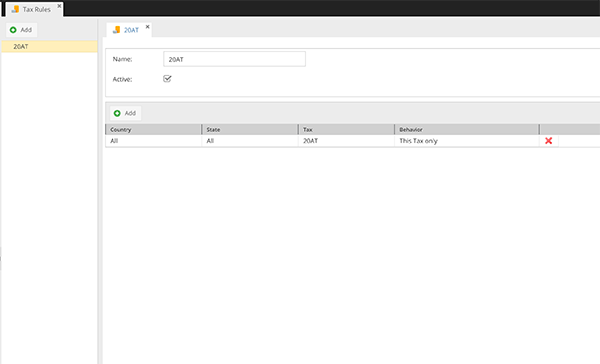

# Tax Rules

Tax Rules in CoreShop are instrumental in determining the appropriate Tax Rate based on the customer's country or state.
These rules ensure that the correct tax is applied to products during transactions.

## Key Components of a Tax Rule

Each Tax Rule is characterized by several important attributes:

- **Name**: The identifier for the Tax Rule.
- **Active**: Indicates whether the Tax Rule is currently in use.
- **Stores**: Specifies which stores can apply this Tax Rule.
- **Rules**: Defines the relationship between Countries/States and Tax Rates, and the handling of scenarios where
  multiple Tax Rates are applicable.

