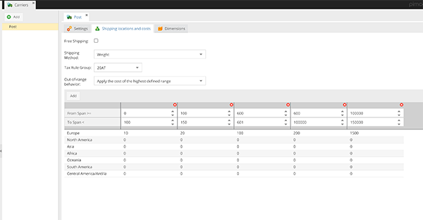
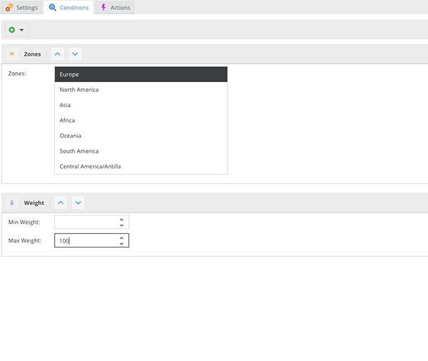
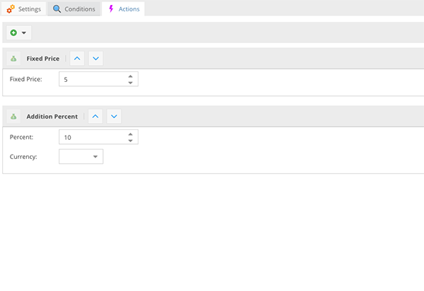

# CoreShop Shipping

## Until Build 87

Shipping prices have been calculated using Ranges. Ranges can be defined by price or weight. Prices are defined using a Zone and a Range. For example (Range is defined as the total cart weight):

| Range | 0-100 | 100-400 | 400-1000 | 1000-10000 |
|---|---|---|---|---|
| Europe | 10 | 20 | 30 | 35 |
| America | 20 | 30 | 50 | 80 |
| Asia | 20 | 40 | 50 | 100 |

The shipping for Europe with a cart-weight of 150kg would be 20.

## Since Build 88

Since Build 88 CoreShop uses "Shipping Rules". Within shipping rules you can define which conditions must be true for which actions. So for example:

Carrier "A" only delivers to Europe and only with a max-weight of 100kg. The price is 5€ + 10% fee.

Your Rule would now look like this:

Your Action would look like this:

