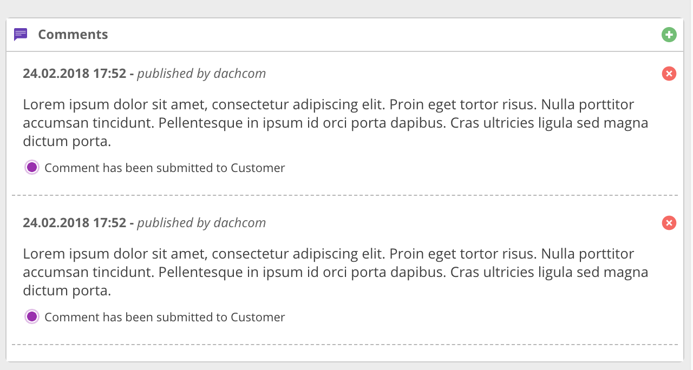
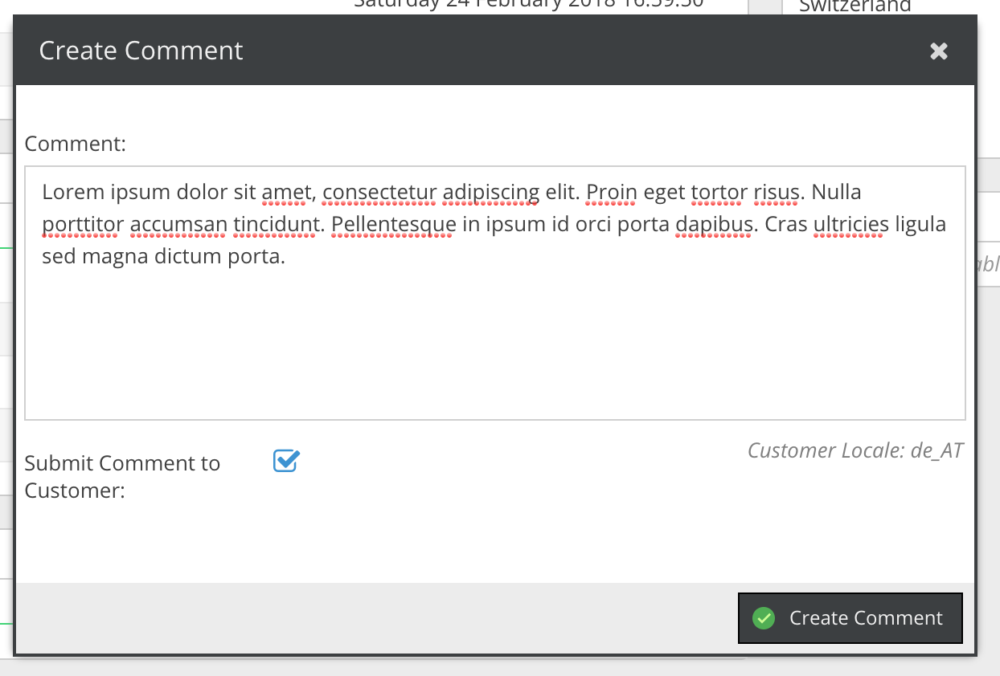

# Order Comments

CoreShop features a straightforward comment interface, enabling you to add notes to any order. This functionality
facilitates efficient communication and record-keeping within order management.

## Adding and Managing Comments

You can easily append simple notes or comments to an order through this interface. These comments can serve as internal
reminders or clarifications regarding the order's processing or specific customer requests.

## Sharing Comments with Customers

For enhanced customer interaction, CoreShop allows you to share these comments directly with the customer. To do this:

- Check the option "Submit Comment to Customer" when adding a comment.

> **Important Note:** Ensure you have a valid Notification Rule set up in CoreShop to successfully send comments to
> customers. This rule is necessary for the system to deliver comment notifications appropriately.
