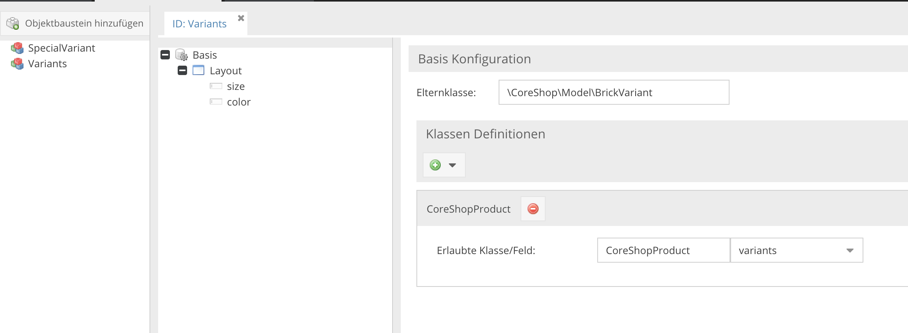
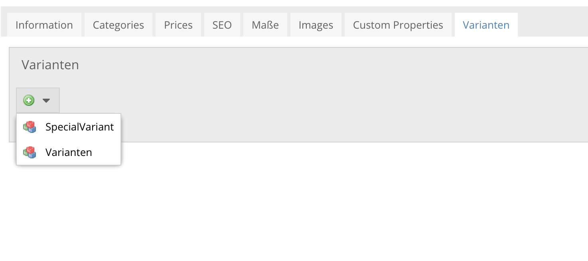
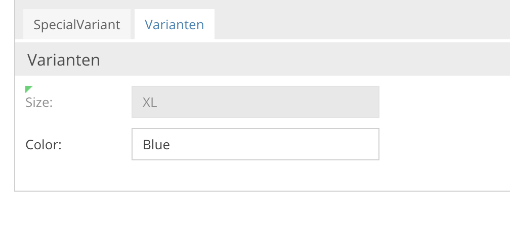
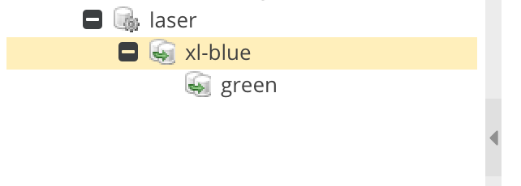

# CoreShop Product Variants

Creating variants is easy.

### Objectbrick

- create a objectbrick and call it "sizes" for example.

> **Important**
> Every objectbrick needs to extend `\CoreShop\Model\BrickVariant` if you want to use its elements as a variant. so add `\CoreShop\Model\BrickVariant` into the ParentClass input field.
> Otherwise you will get an error like "Objectbrick "getSizes" needs to be a instance of \CoreShop\Model\BrickVariant" on your product detail page.

- in _Class Definition_ add "CoreShopProduct" as a new Class and set _allowed field_ to "variants". 
- you can add as many bricks as you want, just be sure that they are assigned to the variants field.

### Filling up

- create a product
- go to "variants" (last tab) and add your fresh objectbrick
- fill out your fields

### Create Variant Products

- create some sub-products. they called "variants" in pimcore: right click to your product, click on "add variant" and change the variants in the same manner you've learned it in the steps before
- save your products

### Enjoy

CoreShop automatically calculates the correct dependencies of each variant element, so probably there is nothing else to do.

### Templating

Use the `views/template/default/views/scripts/coreshop/product/detail.php` file to get a kickstarter.

### Benefits

**allowed fields for variations:**

- `input`
- `numeric`
- `checkbox`
- `select`
- `slider`
- `objects`

**objects:**

its possible to extends the `BrickVariant` Class to override the `getValueForVariant()` method. to do so, create a php file in `website/lib/Website/Model` called `Variant.php`. Change the ParentClass in your ObjectBrick. 
