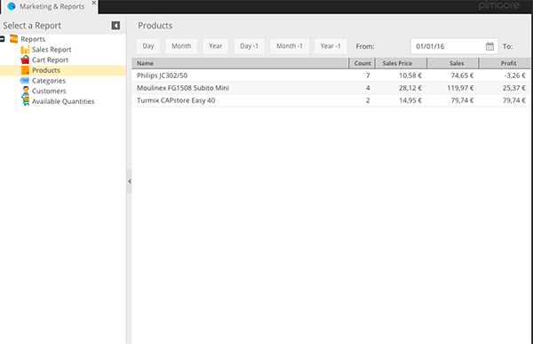

# Products Report

The CoreShop Products Report provides a comprehensive view of product performance, including sales, quantities, and
profits. This report is instrumental for analyzing product trends and making informed inventory decisions.

## Report Format

The Products Report is presented in a list format with pagination.

| Type | Has Pagination |
|:-----|:---------------|
| List | Yes            |

## Customizing the Report with Filters

Enhance your analysis by applying various filters:

| Name          | Description                                                      |
|:--------------|:-----------------------------------------------------------------|
| Store         | Filter data by specific Store.                                   |
| Day           | Filter for the current Day.                                      |
| Month         | Filter for the current Month.                                    |
| Year          | Filter for the current Year.                                     |
| Day -1        | Filter for the previous Day.                                     |
| Month -1      | Filter for the previous Month.                                   |
| Year -1       | Filter for the previous Year.                                    |
| From          | Start date for the filter period.                                |
| To            | End date for the filter period.                                  |
| Product Types | Group data by `Main Products`, `Variants`, `Container Products`. |

## Understanding Product Types

Differentiate products based on their type for targeted analysis:

| Name               | Description                                                                                                    |
|:-------------------|:---------------------------------------------------------------------------------------------------------------|
| Main Products      | Displays only products without variant inclusion.                                                              |
| Variants           | Shows only variant product types.                                                                              |
| Container Products | Summarizes products and their child-products. Note: Ignored in report if the main pimcore objects are deleted. |

## Key Grid Fields

Analyze key metrics with the following data fields:

| Name        | Description                             |
|:------------|:----------------------------------------|
| Name        | Product name.                           |
| Order Count | Total number of orders for the product. |
| Quantity    | Total quantity sold.                    |
| Sale Price  | Average sale price.                     |
| Sales       | Total sales amount.                     |
| Profit      | Total profit amount.                    |
