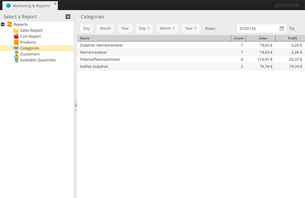

# Categories Report

The CoreShop Categories Report offers valuable insights into the performance of different product categories within your
e-commerce store. This data can be instrumental in making informed decisions about inventory and marketing strategies.

## Report Format

The Categories Report is displayed in a list format.

| Type | Has Pagination |
|:-----|:---------------|
| List | No             |

## Applying Filters for Detailed Analysis

Customize the report for targeted insights using the following filters:

| Name     | Description                         |
|:---------|:------------------------------------|
| Store    | Filter results by a specific Store. |
| Day      | Filter for the current Day.         |
| Month    | Filter for the current Month.       |
| Year     | Filter for the current Year.        |
| Day -1   | Filter for the previous Day.        |
| Month -1 | Filter for the previous Month.      |
| Year -1  | Filter for the previous Year.       |
| From     | Start date for the filter period.   |
| To       | End date for the filter period.     |

## Key Grid Fields

The report includes several essential fields for comprehensive category analysis:

| Name        | Description                                      |
|:------------|:-------------------------------------------------|
| Name        | The name of the product category.                |
| Order Count | Total number of orders in the category.          |
| Quantity    | Total quantity of products sold in the category. |
| Sales       | Total sales generated from the category.         |
| Profit      | Total profit from the category.                  |
