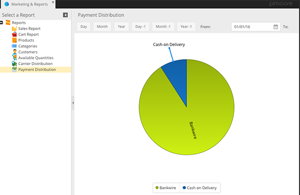

# Payment Distribution Report

The CoreShop Payment Distribution Report offers a detailed analysis of the various payment methods used in your
e-commerce store. Presented as a pie chart, this report is essential for understanding customer payment preferences and
optimizing your payment options.

## Report Format

This report utilizes a pie chart format to provide a visual overview of payment distribution.

| Type      | Has Pagination |
|:----------|:---------------|
| Pie Chart | No             |

## Applying Filters for Detailed Insights

Customize your report using the following filters to focus on specific data points:

| Name     | Description                                    |
|:---------|:-----------------------------------------------|
| Store    | Filter data by specific Store.                 |
| Day      | Filter for transactions on the current Day.    |
| Month    | Filter for transactions in the current Month.  |
| Year     | Filter for transactions in the current Year.   |
| Day -1   | Filter for transactions on the previous Day.   |
| Month -1 | Filter for transactions in the previous Month. |
| Year -1  | Filter for transactions in the previous Year.  |
| From     | Start date for the filter period.              |
| To       | End date for the filter period.                |

## Chart Field

The Payment Distribution Report includes the following field:

- **Payment Provider Distribution**: This field visualizes the usage frequency of each payment provider, enabling you to
  assess which payment methods are most popular among your customers.
