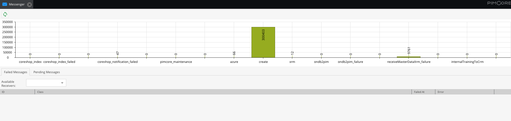

# Messenger Bundle

The CoreShop Messenger Bundle provides a user-friendly interface to view queued Messenger tasks across different queues.



## Installation Process

To install the Messenger Bundle, use Composer:

```bash
$ composer require coreshop/messenger-bundle:^4.0
```

### Integrating with the Kernel

To enable the bundle, update the `AppKernel.php` file:

```php
<?php

// app/AppKernel.php

public function registerBundlesToCollection(BundleCollection $collection)
{
    $collection->addBundles([
        new \CoreShop\Bundle\MessengerBundle\CoreShopMessengerBundle(),
    ]);
}
```

## The "Failed At" Date

The date shown in the "Failed At" column of the failed messages grid is resolved from the envelope by a
chain of `CoreShop\Bundle\MessengerBundle\Messenger\FailedAtResolverInterface` implementations. Two are
shipped out of the box:

* `RedeliveryStampFailedAtResolver` reads Symfony's `RedeliveryStamp`, which Messenger adds when it
  retries a message or moves it to the failure transport.
* `AmqpDeathHeaderFailedAtResolver` reads RabbitMQ's `x-death` header. Messages that the broker itself
  dead-lettered never pass through Messenger's failure handling and therefore carry no `RedeliveryStamp`;
  the header is the only timestamp available for them. Only `rejected` entries are used, because delayed
  messages are dead-lettered as well and would otherwise look like failures on their first dispatch.

Additional resolvers can be registered with the `coreshop.messenger.failed_at_resolver` tag. They are
asked in descending `priority` order and the first one returning a date wins:

```yaml
services:
    App\Messenger\MyFailedAtResolver:
        tags:
            - { name: coreshop.messenger.failed_at_resolver, priority: 200 }
```
