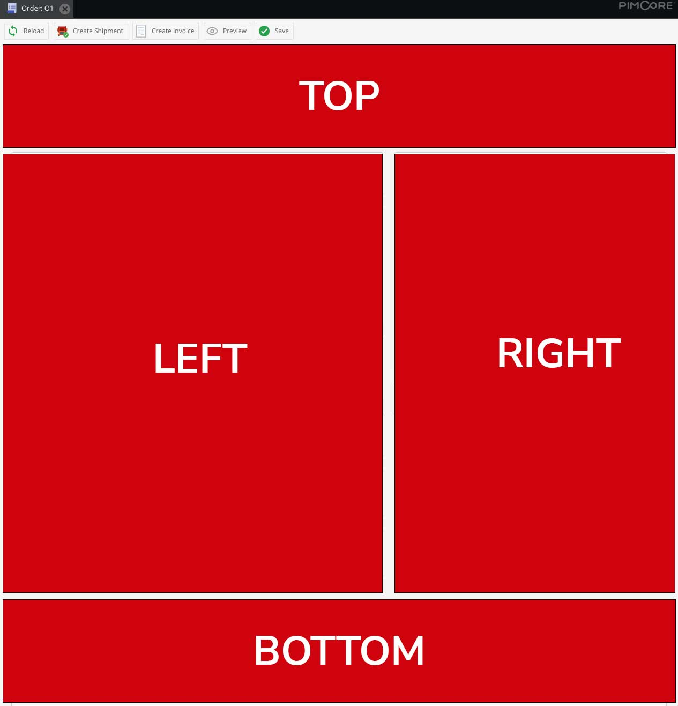

# Extending Order Detail

CoreShop's Order Detail Page is a custom-designed interface built with ExtJs, offering straightforward ways to extend
and customize it according to your specific needs.

## UI Overview

The Order Detail UI consists of various blocks strategically positioned for optimal user experience. There are four main
positions for these blocks:

- **Top**: At the top of the page.
- **Left**: On the left side of the page.
- **Right**: On the right side of the page.
- **Bottom**: At the bottom of the page.



## Default Blocks

The following are the default blocks provided by CoreShop:

- **Top**
    - Header
- **Left**
    - Payments
    - Invoices
    - Shipments
    - Correspondence
- **Right**
    - Customer Details
    - Comments
- **Bottom**
    - Details

## Creating a New Block

To introduce a new block, you'll need to create a new Pimcore Backend Javascript File, following the
namespace `coreshop.order.order.detail.blocks`.

### Example

Below is a sample JavaScript code to demonstrate how to add a custom block:

```javascript
pimcore.registerNS('coreshop.order.order.detail.blocks.custom');
coreshop.order.order.detail.blocks.custom = Class.create(coreshop.order.order.detail.abstractBlock, {
    saleInfo: null,

    initBlock: function () {
        var me = this;

        me.deliveryPhone = Ext.create({
            xtype: 'panel',
            style: 'display:block'
        });

        me.purchaseOrderNumber = Ext.create({
            xtype: 'panel',
            style: 'display:block'
        });

        me.trackingMail = Ext.create({
            xtype: 'panel',
            style: 'display:block'
        });

        me.packagingType = Ext.create({
            xtype: 'panel',
            style: 'display:block'
        });

        me.packagingAmount = Ext.create({
            xtype: 'panel',
            style: 'display:block'
        });

        var items = [];

        items.push({
            xtype: 'panel',
            layout: 'hbox',
            items: [
                {
                    xtype: 'panel',
                    flex: 1,
                    items: [
                        me.purchaseOrderNumber,
                        me.deliveryPhone,
                        me.trackingMail
                    ]
                },
                {
                    xtype: 'panel',
                    flex: 1,
                    items: [
                        me.packagingType,
                        me.packagingAmount
                    ]
                }
            ]
        });

        this.details = Ext.create('Ext.panel.Panel', {
            title: t('zeroridge_order_informations'),
            margin: '0 20 20 0',
            border: true,
            flex: 6,
            iconCls: 'coreshop_icon_order',
            items: items
        });
    },

    getPriority: function () {
        return 1;
    },

    getPosition: function () {
        return 'left';
    },

    getPanel: function () {
        return this.details;
    },

    updateSale: function () {
        var me = this;

        me.deliveryPhone.setHtml('<span style="font-weight:bold;">' + t('zeroridge_delivery_phone') + ': </span>' + me.sale.deliveryPhone);
        me.purchaseOrderNumber.setHtml('<span style="font-weight:bold;">' + t('zeroridge_purchase_order_number') + ': </span>' + me.sale.purchaseOrderNumber);
        me.trackingMail.setHtml('<span style="font-weight:bold;">' + t('zeroridge_tracking_mail') + ': </span>' + me.sale.trackingEmail);

        if (me.sale.packagingType) {
            me.packagingType.setHtml('<span style="font-weight:bold;">' + t('zeroridge_packaging_type') + ': </span>' + me.sale.packagingType.localizedfields.data.en.name);
        } else {
            me.packagingType.setHtml('<span style="font-weight:bold;">' + t('zeroridge_packaging_type') + ': </span> Unknown');
        }

        me.packagingAmount.setHtml('<span style="font-weight:bold;">' + t('zeroridge_packaging_amount') + ': </span>' + me.sale.packagingAmount);
    }
});

```

In this custom block, the following methods must be implemented:

- **initBlock**: Initializes the block upon creation.
- **getPriority**: Determines the display priority of the block. Higher values mean higher placement.
- **getPosition**: Specifies the position of the block (top, left, right, or bottom).
- **getPanel**: Returns the ExtJs Panel representing the content of the block.
- **updateSale**: Updates the block's content when the sale is refreshed

## Customizing Order Serialization

CoreShop uses JMS Serializer for order serialization. You can extend its serialization logic either through JMS
Configuration or by registering an event handler for the `CoreShop\Bundle\OrderBundle\Events::SALE_DETAIL_PREPARE`
event.

If that isn't enough, you can create a Custom Controller and query that with Ext.Ajax and your own parameters.
