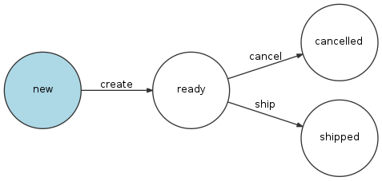
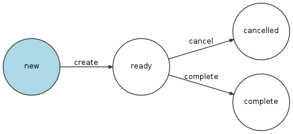

# State Machine - Available Workflows

## Order Sale Workflow

In CoreShop 3.x the Cart, Order and Quote are the same DataObject. To differentiate between them, we use states with
workflows.

State Machine: `coreshop_order_sales_type`

### Available Places

| Name    | Description                                                               |
|:--------|:--------------------------------------------------------------------------|
| `cart`  | Initial State - Cart                                                      |
| `order` | Once the customer finishes the checkout, pre-payment, it becomes an order |
| `quote` | Once the customer finishes the checkout and requests a quote              |

### Available Transition

| Name    | Allowed from Places |
|:--------|:--------------------|
| `order` | `cart`              |
| `cart`  | `cart`              |
| `quote` | `cart`              |

## Order Workflow

State Machine: `coreshop_order`
Description: The Order Workflow is the most simplest and also the most important one.

### Available Places

| Name          | Description                                                                         |
|:--------------|:------------------------------------------------------------------------------------|
| `initialized` | Initial State. Just before a order gets saved for the very first time.              |
| `new`         | a new order has been created                                                        |
| `confirmed`   | customer has successfully placed an order                                           |
| `cancelled`   | order has been cancelled                                                            |
| `complete`    | the order is complete (all payments and shipments have been successfully processed) |

### Available Transition

| Name       | Allowed from Places |
|:-----------|:--------------------|
| `create`   | `initialized`       |
| `confirm`  | `new`               |
| `cancel`   | `new`, `confirmed`  |
| `complete` | `confirmed`         |

### Visualization

## Order Payment Workflow

State Machine: `coreshop_order_payment`
Description: Defines the summary payment state

### Available Places

| Name                 | Description                                 |
|:---------------------|:--------------------------------------------|
| `new`                | order has been initial created              |
| `awaiting_payment`   | a payment has been captured                 |
| `partially_paid`     | one of the order payments has been paid     |
| `cancelled`          | all payments has been cancelled             |
| `paid`               | all order payments successfully paid        |
| `partially_refunded` | one of the order payments has been refunded |
| `refunded`           | all payments has been refunded              |

### Available Transition

| Name               | Allowed from Places                            |
|:-------------------|:-----------------------------------------------|
| `request_payment`  | `new`                                          |
| `partially_pay`    | `awaiting_payment`, `partially_paid`           |
| `cancel`           | `awaiting_payment`                             |
| `partially_refund` | `paid`, `partially_paid`, `partially_refunded` |
| `refund`           | `paid`, `partially_paid`, `partially_refunded` |

### Visualization

## Order Shipment Workflow

State Machine: `coreshop_order_shipment`
Description: Defines the summary shipment state

### Available Places

| Name                | Description                                 |
|:--------------------|:--------------------------------------------|
| `new`               | order has been initial created              |
| `cancelled`         | all shipments has been cancelled            |
| `partially_shipped` | one of the order shipments has been shipped |
| `shipped`           | all order shipments has been shipped        |

### Available Transition

| Name             | Allowed from Places        |
|:-----------------|:---------------------------|
| `partially_ship` | `new`                      |
| `cancel`         | `new`                      |
| `ship`           | `new`, `partially_shipped` |

### Visualization

## Order Invoice Workflow

State Machine: `coreshop_order_invoice`
Description: Defines the summary invoice state

### Available Places

| Name                 | Description                                       |
|:---------------------|:--------------------------------------------------|
| `new`                | order has been initial created                    |
| `cancelled`          | all invoices has been cancelled                   |
| `partially_invoiced` | one of the order invoices has been invoiced       |
| `invoiced`           | all order invoices has been successfully invoiced |

### Available Transition

| Name                | Allowed from Places         |
|:--------------------|:----------------------------|
| `cancel`            | `new`                       |
| `partially_invoice` | `new`                       |
| `invoice`           | `new`, `partially_invoiced` |

### Visualization

## Payment Workflow

State Machine: `coreshop_payment`
Description: Defines the single payment state

### Available Places

| Name         | Description                  |
|:-------------|:-----------------------------|
| `new`        | new payment has been created |
| `processing` | payment has been captured    |
| `completed`  | payment is complete          |
| `failed`     | payment has failed           |
| `cancelled`  | payment has been canceled    |
| `refunded`   | payment has been refunded    |

### Available Transition

| Name       | Allowed from Places |
|:-----------|:--------------------|
| `process`  | `new`               |
| `complete` | `new`, `processing` |
| `fail`     | `new`, `processing` |
| `cancel`   | `new`, `processing` |
| `refund`   | `completed`         |

### Visualization

## Shipment Workflow

State Machine: `coreshop_shipment`
Description: Defines the single shipment state

### Available Places

| Name        | Description                         |
|:------------|:------------------------------------|
| `new`       | new shipment has been created       |
| `ready`     | shipment has been assigned to order |
| `cancelled` | shipment has been cancelled         |
| `shipped`   | shipment has been shipped           |

### Available Transition

| Name     | Allowed from Places |
|:---------|:--------------------|
| `create` | `new`               |
| `ship`   | `ready`             |
| `cancel` | `ready`             |

### Visualization

## Invoice Workflow

State Machine: `coreshop_invoice`
Description: Defines the single invoice state

### Available Places

| Name        | Description                        |
|:------------|:-----------------------------------|
| `new`       | new invoice has been created       |
| `ready`     | invoice has been assigned to order |
| `cancelled` | invoice has been cancelled         |
| `complete`  | invoice has been completed         |

### Available Transition

| Name       | Allowed from Places |
|:-----------|:--------------------|
| `create`   | `new`               |
| `cancel`   | `ready`             |
| `complete` | `ready`             |

### Visualization

