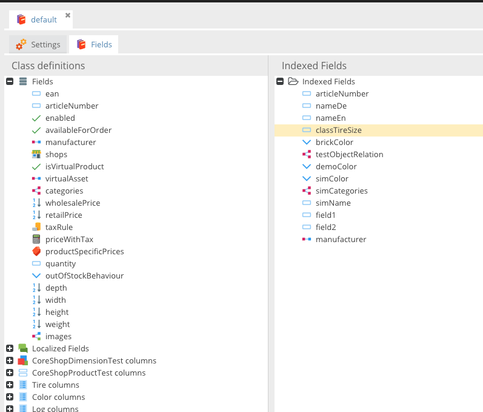

# CoreShop Index

To create a rich layered navigation (faceted navigation), you need to create an index of your Products.

## Create a new Index

CoreShop currently supports two type of indexes:

 - Mysql
 - ~~Elasticsearch~~

### Add Fields

To add a new field, simply drag'n'drop the field from the left tree to the right tree.



### Field Properties

Every field has some properties that needs to be configured


| Field         | Description |
| ------------- |-------------|
| Key           | Pimcore Field Name |
| Name          | Name in the Index |
| Getter Class  | Getter Class is important for field-types like "Localized Fields", "Classification Store", "Object Brick" and "Field Collection". CoreShop needs it to get the right value for the index |
| [Interpreter](./01_Interpreter.md)   | Using Interpreters helps you to transform values before they get stored in the index. For example: Resolving dependencies, create a similarity Index |
| Type          | Type of the field in the index, depends on which Index-Type you are using. [MySql](http://dev.mysql.com/doc/refman/5.7/en/data-types.html) or [Elasticsearch](https://www.elastic.co/guide/en/elasticsearch/reference/current/mapping-types.html) |
| Getter Config | Configuration depends on Getter, for example: Language for Localized Fields |

## Re-Index

If you make changes to the index, you need to re-index all of your products. To do that, there is a CLI command.

```bash
$ php bin/console coreshop:index
```

If you don't want to re-index all of your indices, you can pass the corresponding IDs or names of the indices separated
with a space as arguments to the CLI command. The following example will only re-index indices with IDs 1 and 2 and name
"Products". If none of those indices exist, nothing will be re-indexed.

```bash
$ php bin/console coreshop:index 1 2 Products
```
