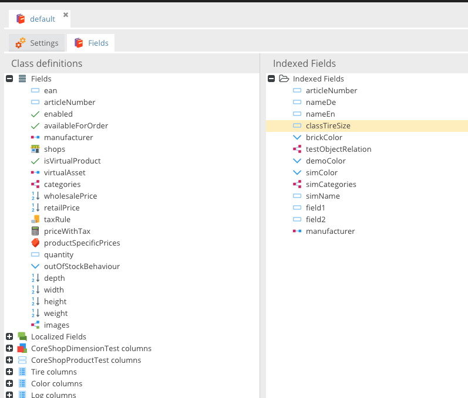
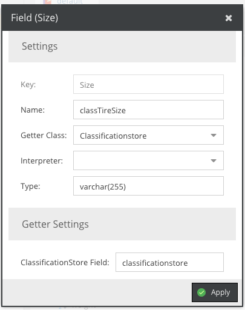

# Index for Layered Navigation

Creating an effective layered navigation (faceted navigation) in CoreShop requires setting up an index of your products.
This index plays a crucial role in enhancing search and filter capabilities within your product catalog.

## Create a New Index

CoreShop currently supports the following types of indexes:

- **MySQL**: Utilizes a MySQL database for indexing.
- **OpenSearch** (since 4.1.3): Utilizes an [OpenSearch](https://opensearch.org/) cluster for indexing.
- **Elasticsearch** (since 5.0): Utilizes an [Elasticsearch](https://www.elastic.co/elasticsearch) cluster for indexing, using the same worker as OpenSearch.

### OpenSearch / Elasticsearch

The OpenSearch worker supports both OpenSearch and Elasticsearch clusters. Depending on your engine, install one of
the Pimcore client packages:

```bash
# For OpenSearch
composer require pimcore/opensearch-client

# For Elasticsearch
composer require pimcore/elasticsearch-client
```

Configure one or more clients via the corresponding configuration tree:

```yaml
# OpenSearch
pimcore_open_search_client:
    clients:
        default:
            hosts: ['https://opensearch:9200']
            username: 'admin'
            password: 'somethingsecret'

# Elasticsearch
pimcore_elasticsearch_client:
    clients:
        default:
            hosts: ['https://elasticsearch:9200']
            username: 'elastic'
            password: 'somethingsecret'
```

Every configured client is automatically registered and can be selected when creating an index with the type
**OpenSearch**. If both packages are installed and a client name exists in both configurations, the OpenSearch client
keeps the plain name and the Elasticsearch client is available as `elasticsearch_<name>`.

The worker provides the following options:

| Option             | Description                                                    |
|--------------------|----------------------------------------------------------------|
| Client             | The search client to use (from the configuration above).       |
| Number of Shards   | Number of shards for the created index (default `1`).          |
| Number of Replicas | Number of replicas for the created index (default `1`).        |

### Adding Fields to the Index

To add new fields to the index:

1. Simply drag and drop the field from the left tree into the right tree.



### Field Properties

Each field in the index requires certain properties to be configured:



| Field                              | Description                                                                                                                                                          |
|------------------------------------|----------------------------------------------------------------------------------------------------------------------------------------------------------------------|
| Key                                | The Pimcore field name.                                                                                                                                              |
| Name                               | The name of the field in the index.                                                                                                                                  |
| Getter Class                       | Important for field-types like "Localized Fields", "Classification Store", "Object Brick", and "Field Collection". Used to retrieve the correct value for the index. |
| [Interpreter](./01_Interpreter.md) | Transforms values before they are stored in the index, e.g., resolving dependencies or creating a similarity index.                                                  |
| Type                               | The field type in the index, depending on the index type                                                                                                             |
| Getter Config                      | Configuration options for the Getter, such as language for Localized Fields.                                                                                         |

## Re-Indexing Products

After modifying the index, it's necessary to re-index your products using a CLI command:

```bash
$ php bin/console coreshop:index
```

For selective re-indexing, specify IDs or names of the indices as arguments. For example, to re-index only indices with
IDs 1 and 2 and the index named "Products":

```bash
php bin/console coreshop:index 1 2 Products
```

## Messenger

Remember to process the queue coreshop_index to automatically index your products when they are saved. This ensures that
your product index remains up-to-date with all the latest changes.

```bash
bin/console messenger:consume coreshop_index
```