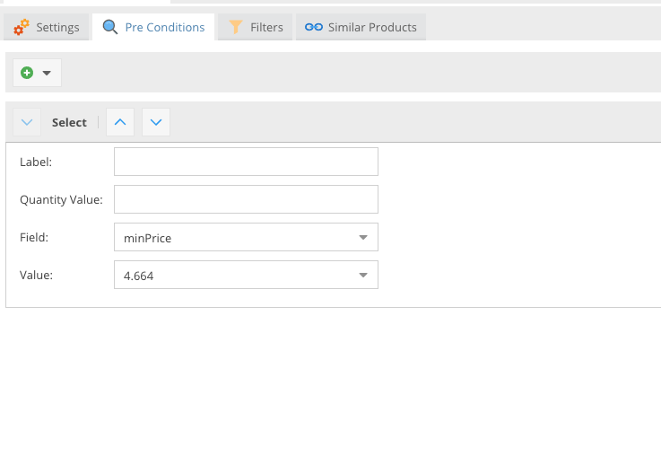
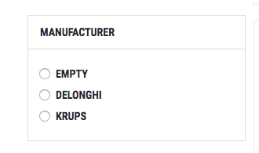
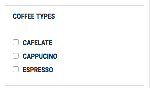

# Filter Configuration

After setting up the product index, the next step is to configure filters. These filters enhance the user experience by
enabling customers to easily find products based on various criteria.

## Creating a New Filter

Filters can be tailored for different categories in your store. Each filter comprises settings, pre-conditions, specific
filters, and options for similar products. Custom filters can also be created as detailed
in [Custom Filters](01_Custom_Filter.md).

### Filter Settings

Configure the basic settings of your filter:

| Field            | Description                                                                                        |
|------------------|----------------------------------------------------------------------------------------------------|
| Name             | The name of the filter set.                                                                        |
| Index            | The index to be used for filtering.                                                                |
| Order            | The default order in which products are displayed.                                                 |
| Order Key        | The index field used for sorting products.                                                         |
| Results per Page | Number of products displayed per page. This can be set using shop settings or overridden manually. |

### Pre-Conditions

Define pre-filters for the index:

These pre-filters refine the initial dataset before any user-driven filtering.

### Conditions

Set up various filters that will be available to customers:

CoreShop supports four main types of filters:

#### Select Condition

- **Description**: A dropdown field allowing the selection of a single option.
- **Example**:

  

#### Multiselect Condition

- **Description**: A list where multiple options can be selected.
- **Example**:

  

#### Range Condition

- **Description**: A slider representing a range, with automatic calculation of MIN and MAX values.
- **Example**:

  

#### Boolean Condition

- **Description**: A set of checkboxes for selecting various boolean (true/false) options.
- **Example**:

  

With these filter configurations, customers can easily navigate and discover products in your store, enhancing their
shopping experience.
