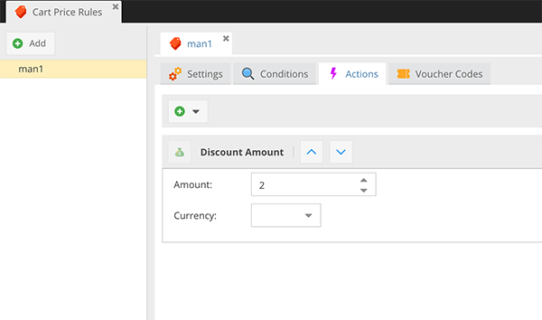

# CoreShop Cart Price Rules Documentation

Cart price rules in CoreShop provide a flexible way to offer discounts and promotions in your e-commerce store built on the Pimcore platform. These rules can be based on various conditions, such as cart subtotal, specific products, customer groups, or other criteria. This documentation will guide you through creating and managing cart price rules in CoreShop.

## Available Actions

- [Free Shipping](./06_Actions.md#free-shipping)
- [Gift Product](./06_Actions.md#gift-product)
- [Discount Amount](./06_Actions.md#discount-amount)
- [Discount Percent](./06_Actions.md#discount-percent)

## Available Conditions

- [Customers](./07_Conditions.md#customers)
- [Customer Groups](./07_Conditions.md#customer-groups)
- [Time Span](./07_Conditions.md#time-span)
- [Voucher](./07_Conditions.md#voucher)
- [Amount](./07_Conditions.md#amount)
- [Countries](./07_Conditions.md#countries)
- [Zones](./07_Conditions.md#zones)
- [Stores](./07_Conditions.md#stores)
- [Currencies](./07_Conditions.md#currencies)
- [Carriers](./07_Conditions.md#carriers)
- [Nested Rules](./07_Conditions.md#nested-rules)
- [Products](./07_Conditions.md#products)
- [Categories](./07_Conditions.md#categories)
