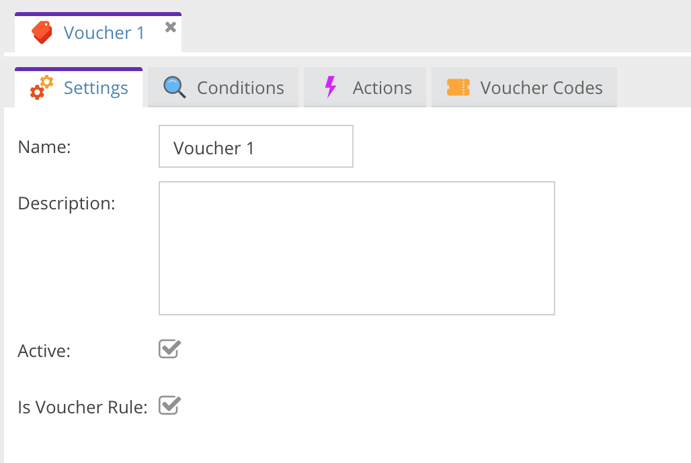

# Vouchers

> **Info**: In CoreShop, vouchers are a type of Price Rule.
> To utilize or generate Vouchers, you need to create a Cart Price Rule.

## How to Create Vouchers

To create a voucher, start by making a new [cart price rule](./01_Cart_Price_Rules.md) and activate the "Is Voucher
Rule" option. This will enable the "Voucher Codes" tab.

### Voucher Condition

For more control over Voucher handling, add the "Voucher" condition.

| Name                            | Description                                     |
|:--------------------------------|:------------------------------------------------|
| Max. Usage per Code             | Define the maximum usage for each voucher code. |
| Allow only one Voucher per Code | Limit to one voucher per cart if checked.       |

### Voucher Codes

Manage your voucher codes in the "Voucher Codes" tab, where you can also export codes to a CSV file.

> For global statistics about vouchers, refer to the [voucher report](../09_Reports/09_Vouchers.md).

| Name          | Description                                             |
|:--------------|:--------------------------------------------------------|
| Code          | The generated voucher code.                             |
| Creation Date | The date when the voucher was created.                  |
| Used          | Indicates if the voucher has been used (true or false). |
| Uses          | The number of times each code has been used.            |
| Action        | Option to delete codes not in use.                      |

### Creating Voucher Codes

There are two methods for generating voucher codes:

#### Single Voucher Code

Create an individual voucher code. Note that duplicate strings are not allowed and will trigger an error message.

#### Voucher Codes Generator

For bulk generation, use the Voucher Codes Generator:

| Name                       | Description                                                  |
|:---------------------------|:-------------------------------------------------------------|
| Amount                     | Number of voucher codes to generate.                         |
| Length                     | Length of each voucher code.                                 |
| Format                     | Format of the code: `Alphanumeric`, `Alphabetic`, `Numeric`. |
| Prefix                     | A prefix for each code, e.g., `SHOP-`.                       |
| Suffix                     | A suffix for each code, e.g., `-SHOP`.                       |
| Hyphens every X characters | Inserts a dash (`-`) after every X characters.               |
