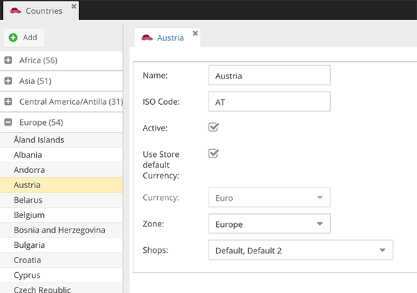

# Country Configuration

In CoreShop, each country is defined by a set of attributes that determine how it interacts with your store. Here's what
each attribute represents:

- **Name**: The official name of the country.
- **ISO-Code**: The standardized international code for the country.
- **Active**: This flag determines if customers from this country can make purchases from your store.
- **Use Store Default Currency**: When checked, transactions from this country will use your store's default currency.
- **Currency**: The specific currency associated with the country.
- **Zone**: The geographical or commercial zone to which the country belongs.
- **Stores**: Specifies which of your stores the country settings apply to.

