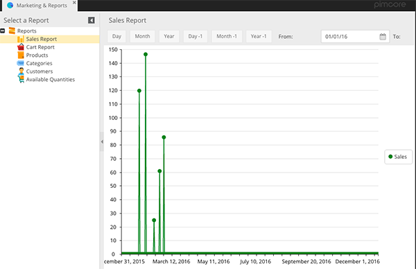

# Sales Report Overview

The CoreShop Sales Report provides a comprehensive analysis of sales data, enabling you to track and understand sales
trends over different time periods.

## Report Format

The Sales Report is presented in a Cartesian Chart format.

| Type            | Has Pagination |
|:----------------|:---------------|
| Cartesian Chart | No             |

## Filters for Tailored Analysis

Customize your sales data view using a variety of filters:

| Name     | Description                                 |
|:---------|:--------------------------------------------|
| Store    | Filter sales by specific Store.             |
| Day      | Filter sales for the current Day.           |
| Month    | Filter sales for the current Month.         |
| Year     | Filter sales for the current Year.          |
| Day -1   | Filter sales for the previous Day.          |
| Month -1 | Filter sales for the previous Month.        |
| Year -1  | Filter sales for the previous Year.         |
| From     | Start date for the sales filter period.     |
| To       | End date for the sales filter period.       |
| Group By | Group sales data by `Day`, `Month`, `Year`. |

## Chart Data Fields

The sales chart includes the following data fields:

| Name | Description         |
|:-----|:--------------------|
| Y    | Total Sales Amount. |
| X    | Date of Sales.      |
